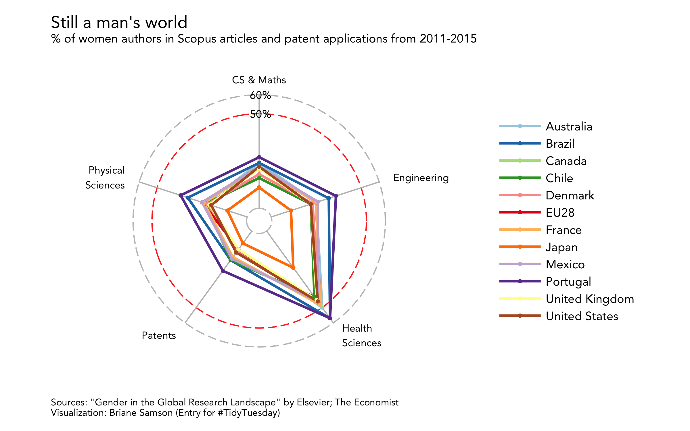

# #TidyTuesday 16

For my very first entry for #TidyTuesday, I chose to remix the The Economist **Women in Research** visualization shared on this [blog by Sarah Leo](https://medium.economist.com/mistakes-weve-drawn-a-few-8cdd8a42d368)). 

### Original

The original is a _point chart_ that uses vertical bars for the four disciplines and a circle for patent applications. Because of the space constraint, the author was "tempted to force all the data we have into a slot that’s way too small." And it shows because of the use of two different encodings for the same value, and the stacking and bunching up of vertical bars.

### Remixed

In my remixed version, I chose to go with a _radar chart_ and focus on creating an apparent profile for each country on the list. This type of chart would work in this case because the shapes formed give a sense of how lacking the profile of each country is, even without looking at the axis labels.